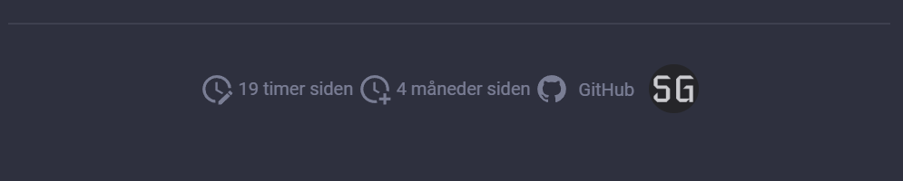

# mkdocs-footermatter (Work in progress..)
[](https://github.com/sondregronas/mkdocs-footermatter/)
[](https://github.com/sondregronas/mkdocs-footermatter/commit/)
[](https://www.gnu.org/licenses/agpl-3.0.en.html)
[](https://codecov.io/gh/sondregronas/mkdocs-footermatter)
[](https://www.buymeacoffee.com/u92RMis)

A plug-in to extract `authors`, `created` and `updated` data from the YAML fronmatter to be rendered in a footer template.

This solves a problem I had when batch renaming every file inside a GitHub action which would overwrite the aforementioned logs. (Renaming `%20` to `-`)



Inspired by [git-revision-date-localized](https://github.com/timvink/mkdocs-git-revision-date-localized-plugin) and [mkdocs-git-committers-plugin](https://github.com/ojacques/mkdocs-git-committers-plugin-2), without the need of using git logs.

## Setup
Install the plugin using pip:

`pip install git+https://github.com/sondregronas/mkdocs-footermatter@main` (Note: might move the plugin to PyPI later.)

Activate the plugin in `mkdocs.yml`:

```yaml
plugins:
  - search
  - footermatter:
      author_map:
        - Firstname Lastname | assets/img/firstname.png | https://github.com/firstnamelastname
        - Author2 | <path from "custom_dir"> | htts://github.com/author2
```
> **Note:** If you have no `plugins` entry in your config file yet, you'll likely also want to add the `search` plugin. MkDocs enables it by default if there is no `plugins` entry set, but now you have to enable it explicitly.

### Usage
Can be used in conjunction with the Obsidian plug-in [update-time-on-edit-obsidian](https://github.com/beaussan/update-time-on-edit-obsidian)

Example frontmatter:

```markdown
---
authors:
  - Firstname Lastname
  - Author2
created: 2022-04-09 08:52:19
updated: 2022-08-13 12:18:05
---
```

## Configuration options
**Fronmatter keys:**
- `key_authors` fronmatter syntax for authors. Default: `authors`
- `key_created` frontmatter syntax for date created. Default: `created`
- `key_updated` frontmatter syntax for date updated. Default: `updated`

**Locale & format:**
- `locale` language format for date_format (some options may require this to be configured, see below) fallbacks to theme language (recommended) or `en` 
- `date_format` What format to use for the dates, see below for options. Default: `date`

**Author rendering options:**
- `author_map` List of authors mapped image and url values: `name | img (path relative to "custom_dir" or url) | url/website`
- `separator_map` separator for `author_map`. Default `|`
- `default_author_img` fallback image if missing from `author_map`. Default `https://ui-avatars.com` (See template for details)
- `default_author_url` fallback url if missing from `author_map`. Default: `/`

## Date formats
Note: values are static and only changes when building your docs.
- `timeago` (2 hours ago) - a readable, relative date format. **_Locale must be one of [timeago's locales](https://github.com/hustcc/timeago/tree/master/src/timeago/locales)_**, which might be limited for multilingual support.
- `date` (January 1. 2022) - simple date format. Locale can be set by the theme for [multilingual pages support](https://github.com/ultrabug/mkdocs-static-i18n)
- `datetime` (January 1. 2022 12:00:00) - same as date, but with added timestamp
- For custom formats just pass [a valid strftime template](https://strftime.org/). Example: `%B %Y` = January 2022

## Template
An example setup can be seen in the [overrides](https://github.com/sondregronas/mkdocs-footermatter/tree/main/overrides) folder, including some css styling and an example [main.html](https://github.com/sondregronas/mkdocs-footermatter/blob/main/overrides/main.html)

Relevant context values:
```yaml
{{ footermatter_updated }}
{{ footermatter_created }}

    {{ author.name }}
    {{ author.img }} 
    {{ base_url }}/{{ author.img }}
    {{ author.url }}

```
